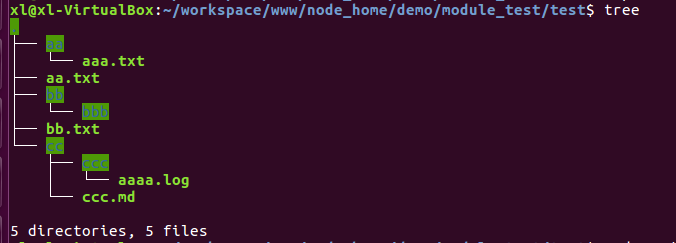
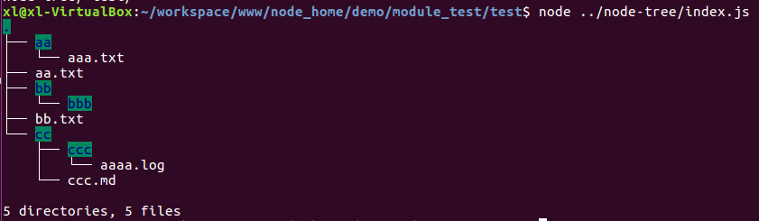
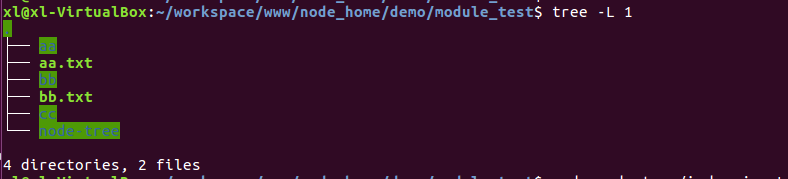
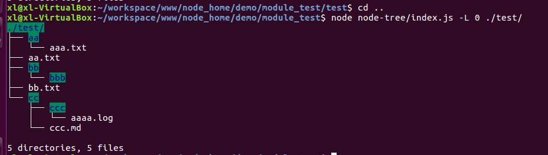

# node-tree
node实现linux下Tree -L命令，展示目录。

# how to start
npm install

# how to use
### 1 展示所有目录
### tree

### node ../node-tree/index.js

### 2 展示指定目录级数
### tree -L 1

### node node-tree/index.js -L 1

### 3 【拓展】展示指定目录

